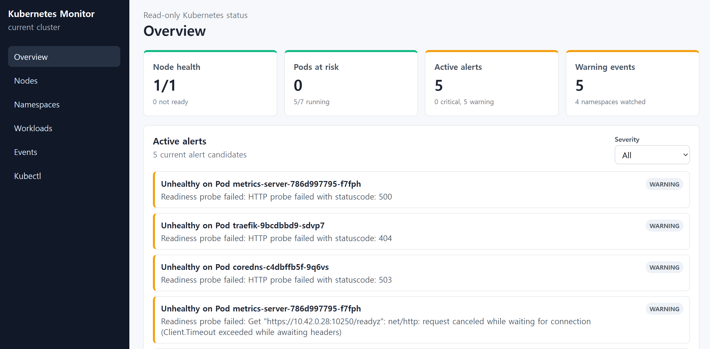

# Kubernetes Monitor

하나의 Kubernetes 클러스터를 읽기 전용으로 모니터링하는 경량 웹 애플리케이션입니다. MVP는 EC2 한 대에서 K3s 단일 노드 Kubernetes, Fastify 백엔드, React/Vite 프론트엔드를 함께 실행해 실제 Kubernetes API 연결을 검증합니다.

## Screenshot



## 진행 상황

- 백엔드는 kubeconfig 또는 in-cluster service account로 Kubernetes API와 metrics API를 조회합니다.
- 프론트엔드는 백엔드 API만 호출하며 Overview, Nodes, Namespaces, Workloads, Pod detail, Events, Alert panel을 제공합니다.
- metrics-server가 있으면 CPU/memory usage를 표시하고, 없으면 degraded 상태와 `unavailable` usage를 표시합니다.
- CI는 install, format check, lint/typecheck, build, test를 실행합니다.
- 실제 EC2 smoke는 `docs/DEVELOPMENT.md` 절차로 반복 실행합니다.

## 설치

```sh
pnpm install
```

필수 도구:

- Node.js 22 이상.
- pnpm 10.10.0 이상.
- 실제 Kubernetes 연결 검증 시 `kubectl`과 kubeconfig.
- EC2 단일 노드 검증 시 K3s.

EC2에서 K3s를 설치하고 kubeconfig를 준비하는 절차는 `docs/KUBERNETES_SETUP.md`를 따릅니다.

## 실행

### EC2 중지 후 재시작 순서

EC2를 stop/start 한 뒤에는 K3s, 백엔드, 프론트엔드 순서로 확인하거나 실행합니다. K3s는 systemd 서비스라 정상 설치되어 있으면 부팅 후 자동으로 올라옵니다. 별도의 네트워크 연결 작업은 필요 없고, 백엔드는 `KUBECONFIG`로 Kubernetes API에 연결하며 프론트엔드는 Vite proxy로 백엔드에 연결합니다.

1. EC2에 접속하고 저장소로 이동합니다.

```sh
cd /home/ubuntu/workspace/k8s-monitor
```

2. Kubernetes가 준비됐는지 확인합니다.

```sh
systemctl is-active k3s
KUBECONFIG=$HOME/.kube/config kubectl get nodes
KUBECONFIG=$HOME/.kube/config kubectl get --raw /version
```

`systemctl is-active k3s`가 `active`가 아니면 K3s를 시작해야 합니다. 이 명령은 systemd 서비스 변경이라 `sudo`가 필요합니다.

```sh
sudo systemctl start k3s
```

3. 백엔드를 실행합니다.

```sh
HOST=0.0.0.0 PORT=3000 KUBECONFIG=$HOME/.kube/config pnpm dev:backend
```

4. 다른 터미널에서 프론트엔드를 실행합니다.

```sh
VITE_BACKEND_PROXY_TARGET=http://127.0.0.1:3000 pnpm --filter @k8s-monitor/frontend dev --host 0.0.0.0
```

5. 같은 EC2에서 smoke test를 실행합니다.

```sh
curl http://127.0.0.1:3000/api/health
curl http://127.0.0.1:5173/api/health
curl -I http://127.0.0.1:5173/
```

6. 브라우저에서 접속합니다.

```text
http://<EC2_PUBLIC_IP>:5173
```

EC2를 stop/start 하면 Elastic IP를 붙이지 않은 인스턴스의 public IP는 바뀔 수 있습니다. 바뀐 경우 새 public IP로 접속합니다.

실행 중인 백엔드/프론트엔드 프로세스와 포트는 아래처럼 확인합니다.

```sh
ps -eo pid,ppid,lstart,cmd | rg '(@k8s-monitor/backend|@k8s-monitor/frontend|dev:backend|dev:frontend|vite|src/server.ts)'
ss -ltnp | rg ':(3000|5173)\b'
```

재시작을 위해 기존 앱 프로세스를 종료해야 하면 `ps` 출력의 해당 PID에 `kill -TERM`을 보냅니다.

```sh
kill -TERM <PID>
```

### 개발 실행

백엔드:

```sh
HOST=0.0.0.0 PORT=3000 KUBECONFIG=$HOME/.kube/config pnpm dev:backend
```

개발 실행은 watcher가 아니므로 백엔드 코드를 수정한 뒤에는 실행 중인 `pnpm dev:backend` 프로세스를 종료하고 다시 시작해야 합니다. 현재 실행 중인 프로세스와 listen port는 아래처럼 확인합니다.

```sh
ps -eo pid,ppid,lstart,cmd | rg '(@k8s-monitor/backend|dev:backend|src/server.ts)'
ss -ltnp | rg ':3000'
```

프론트엔드:

```sh
VITE_BACKEND_PROXY_TARGET=http://127.0.0.1:3000 pnpm --filter @k8s-monitor/frontend dev --host 0.0.0.0
```

프론트엔드는 브라우저에 HTML/JS를 제공하고, same-origin `/api` 요청은 Vite proxy가 `VITE_BACKEND_PROXY_TARGET`으로 전달합니다. 기본 EC2 개발 구성에서는 브라우저가 `http://<EC2_PUBLIC_IP>:5173`에 접속하고, API 데이터는 `5173 -> 127.0.0.1:3000 -> Kubernetes API` 경로로 조회됩니다.

접속:

```text
http://<EC2_PUBLIC_IP>:5173
```

개발 단계에서는 EC2 security group에서 `5173/tcp`를 필요한 source IP에만 엽니다. 브라우저가 백엔드를 직접 호출하는 구성에서는 `3000/tcp`도 제한적으로 열 수 있지만, 기본 dev 구성은 Vite proxy를 통해 `/api`를 백엔드로 전달합니다.

## 검증

```sh
pnpm format:check
pnpm lint
pnpm build
pnpm test
git diff --check
```

실제 클러스터 smoke:

```sh
curl http://127.0.0.1:3000/api/health
curl http://127.0.0.1:3000/api/cluster/summary
curl http://127.0.0.1:3000/api/nodes
curl http://127.0.0.1:3000/api/workloads
curl "http://127.0.0.1:3000/api/events?limit=10"
curl http://127.0.0.1:3000/api/alerts
```

알림 테스트용 의도적 장애 시나리오는 `docs/FAILURE_TESTING.md`에 분리되어 있습니다. 테스트 전용 클러스터에서만 실행하고, 운영 클러스터에는 적용하지 않습니다.

## 문서

- `docs/PRODUCT_SPEC.md`: MVP 제품 범위와 화면 요구사항.
- `docs/ARCHITECTURE.md`: 런타임 아키텍처와 EC2/Kubernetes 검증 방식.
- `docs/API_CONTRACT.md`: 백엔드/프론트엔드 API 계약.
- `docs/DEVELOPMENT.md`: 로컬 개발, EC2 실행, RBAC, smoke test 기준.
- `docs/KUBERNETES_SETUP.md`: EC2 단일 노드 K3s 설치와 kubeconfig 준비.
- `docs/FAILURE_TESTING.md`: 알림 검증용 장애 리소스와 정리 절차.
- `TASKS.md`: 현재 구현 순서와 남은 작업.
